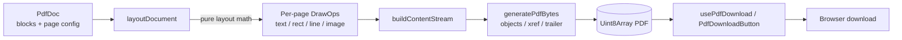

<div align="center">


# react-pdf-generator

### Generate beautiful, downloadable PDFs from plain React data — with zero runtime dependencies.

**Built and maintained by [Viprasol Tech](https://viprasol.com).**

[](https://www.npmjs.com/package/react-pdf-generator)
[](https://github.com/Viprasol-Tech/react-pdf-generator/actions/workflows/ci.yml)
[](https://www.typescriptlang.org/)
[](https://react.dev/)
[](package.json)
[](LICENSE)

</div>

---

`react-pdf-generator` turns a small, serializable document description into a
real `%PDF-1.4` file — entirely in the browser, with **no canvas, no headless
Chrome, and no third-party PDF engine**. Describe your document as an array of
blocks, drop in a `<PdfDownloadButton />`, and your users get a clean,
multi-page PDF on click.

## Features

- 🧩 **Block-based model** — text, headings, tables, lists, images, dividers, spacers, and page breaks.
- 🖼️ **Image embedding** — PNG (RGB/grayscale) and JPEG embedded as native PDF XObjects, with aspect-ratio aware sizing.
- 🔤 **Rich typography** — bold, italic, bold-italic, per-block font size, color, alignment, and line height.
- 📊 **Powerful tables** — relative column widths, per-column alignment, borders, zebra striping, and headers that repeat on every page.
- 📄 **Smart pagination** — content auto-flows across pages; force breaks where you want them.
- 🔢 **Page numbers** — opt-in footer with a `{page} / {total}` template you control.
- 📐 **Page setup** — A4, Letter, Legal, A3, A5, portrait/landscape, and configurable margins.
- ⚛️ **First-class React** — a ready-to-use `<PdfDownloadButton />` and a headless `usePdfDownload()` hook.
- 🚀 **Zero runtime dependencies** & **strict TypeScript** types for every block and prop.
- ♿ **Accessible button** — `aria-busy`, disabled-while-generating, and full attribute forwarding.

## Install

```bash
npm install react-pdf-generator
# or
pnpm add react-pdf-generator
# or
yarn add react-pdf-generator
```

> React 18+ and react-dom are peer dependencies.

## Usage

### Drop-in download button

```tsx
import { PdfDownloadButton, type PdfDoc } from "react-pdf-generator";

const invoice: PdfDoc = {
  title: "Invoice #1024",
  author: "Acme Inc.",
  pageSize: "a4",
  pageNumbers: true,
  blocks: [
    { type: "heading", text: "Invoice #1024", level: 1 },
    { type: "text", text: "Billed to: Jane Doe", color: { r: 90, g: 90, b: 90 } },
    { type: "divider" },
    {
      type: "table",
      header: ["Item", "Qty", "Price"],
      columns: [{ width: 3 }, { width: 1, align: "center" }, { width: 1, align: "right" }],
      zebra: true,
      rows: [
        ["Design retainer", "1", "$2,400.00"],
        ["Hosting (annual)", "1", "$180.00"],
      ],
    },
    { type: "spacer", height: 12 },
    { type: "text", text: "Total: $2,580.00", style: "bold", align: "right", fontSize: 14 },
  ],
};

export function DownloadInvoice() {
  return (
    <PdfDownloadButton doc={invoice} filename="invoice-1024.pdf">
      Download invoice
    </PdfDownloadButton>
  );
}
```

### Headless hook

```tsx
import { usePdfDownload, type PdfDoc } from "react-pdf-generator";

function ExportReport({ doc }: { doc: PdfDoc }) {
  const { download, generating, error } = usePdfDownload();

  return (
    <>
      <button onClick={() => download(doc, "report.pdf")} disabled={generating}>
        {generating ? "Generating…" : "Export PDF"}
      </button>
      {error && <p role="alert">Could not generate PDF: {error.message}</p>}
    </>
  );
}
```

### Embedding an image

```tsx
const logoBytes: Uint8Array = await fetch("/logo.png")
  .then((r) => r.arrayBuffer())
  .then((b) => new Uint8Array(b));

const doc: PdfDoc = {
  blocks: [
    { type: "image", data: logoBytes, width: 160, align: "center" },
    { type: "heading", text: "Annual Report 2025", level: 1, align: "center" },
  ],
};
```

### Generating bytes directly (Node / server-side)

```ts
import { generatePdfBytes } from "react-pdf-generator";
import { writeFileSync } from "node:fs";

writeFileSync("out.pdf", generatePdfBytes(doc));
```

## Architecture



## API

### `<PdfDownloadButton />`

| Prop              | Type                     | Default          | Description                                             |
| ----------------- | ------------------------ | ---------------- | ------------------------------------------------------- |
| `doc`             | `PdfDoc`                 | —                | The document to generate on click. **Required.**        |
| `filename`        | `string`                 | `"document.pdf"` | Download filename.                                      |
| `children`        | `ReactNode`              | `"Download PDF"` | Button label.                                           |
| `generatingLabel` | `ReactNode`              | `children`       | Label shown while generating.                           |
| `onDownloaded`    | `() => void`             | —                | Fired after a successful download is triggered.         |
| `onError`         | `(error: Error) => void` | —                | Fired if generation fails.                              |
| `...rest`         | `button` attributes      | —                | `className`, `aria-label`, `style`, etc. are forwarded. |

### `usePdfDownload()`

| Returns      | Type                       | Description                              |
| ------------ | -------------------------- | ---------------------------------------- |
| `download`   | `(doc, filename?) => void` | Generate and trigger a browser download. |
| `toBlob`     | `(doc) => Blob`            | Get an `application/pdf` `Blob`.         |
| `generating` | `boolean`                  | True while a download is in progress.    |
| `error`      | `Error \| null`            | Last generation error, if any.           |

### `PdfDoc`

| Field         | Type                                          | Default      | Description                       |
| ------------- | --------------------------------------------- | ------------ | --------------------------------- |
| `title`       | `string`                                      | —            | PDF Info title.                   |
| `author`      | `string`                                      | —            | PDF Info author.                  |
| `subject`     | `string`                                      | —            | PDF Info subject.                 |
| `pageSize`    | `"a4" \| "letter" \| "legal" \| "a3" \| "a5"` | `"a4"`       | Page size.                        |
| `orientation` | `"portrait" \| "landscape"`                   | `"portrait"` | Page orientation.                 |
| `margins`     | `Partial<Margins>`                            | `48` all     | Page margins in points.           |
| `pageNumbers` | `boolean \| PageNumberConfig`                 | `false`      | Automatic page-number footer.     |
| `blocks`      | `Block[]`                                     | —            | Document body, rendered in order. |

### Blocks

| `type`      | Key fields                                                                                                   |
| ----------- | ----------------------------------------------------------------------------------------------------------- |
| `text`      | `text`, `fontSize`, `bold`, `italic`, `style`, `align`, `color`, `lineHeight`                                |
| `heading`   | `text`, `level` (1-6), `align`, `color`                                                                      |
| `table`     | `header`, `rows`, `fontSize`, `columns` (`width`/`align`), `borders`, `borderColor`, `zebra`, `repeatHeader` |
| `list`      | `items`, `ordered`, `fontSize`, `indent`, `color`                                                            |
| `image`     | `data` (`Uint8Array`), `width`, `height`, `align`                                                            |
| `divider`   | `thickness`, `color`, `spacing`                                                                              |
| `pageBreak` | —                                                                                                           |
| `spacer`    | `height`                                                                                                    |

> Colors are `{ r, g, b }` with each channel 0–255. Sizes are in PostScript points (1pt = 1/72 inch).

## Roadmap

- [x] Images (PNG + JPEG)
- [x] Multi-page auto-flow & manual page breaks
- [x] Font sizes, styles & colors
- [x] Tables with column widths, alignment, borders & zebra
- [x] Page numbers & margins
- [x] More page sizes + landscape
- [ ] Embedded custom fonts (TTF subsetting)
- [ ] Links and bookmarks (outline tree)
- [ ] SVG / vector primitives
- [ ] Palette & RGBA PNG support

## FAQ

**Does this render in the browser without a server?**
Yes. Everything runs client-side and produces a real PDF byte stream — no headless browser or network round-trip.

**How big is it?**
Zero runtime dependencies. The whole writer is pure TypeScript.

**Which images are supported?**
JPEG, and 8-bit non-interlaced RGB or grayscale PNG. For PNGs with alpha or palettes, flatten to RGB or convert to JPEG first.

**Can I use it on the server (Node)?**
Yes — call `generatePdfBytes(doc)` to get a `Uint8Array` and write it to disk. The React layer is optional.

**Are fonts embedded?**
It uses the standard "base 14" Helvetica family (regular/bold/oblique/bold-oblique), so no embedding is needed and files stay tiny.

## Contributing

Contributions are welcome! Please open an issue to discuss substantial changes
first. To get started:

```bash
git clone https://github.com/Viprasol-Tech/react-pdf-generator.git
cd react-pdf-generator
npm install
npm run typecheck
npm test
```

See [CONTRIBUTING.md](CONTRIBUTING.md) and our [Code of Conduct](CODE_OF_CONDUCT.md).

## Contact — Viprasol Tech Private Limited

- Website: [viprasol.com](https://viprasol.com)
- Email: [support@viprasol.com](mailto:support@viprasol.com)
- Telegram: [t.me/viprasol_help](https://t.me/viprasol_help) | WhatsApp: +91 96336 52112
- GitHub: [@Viprasol-Tech](https://github.com/Viprasol-Tech) | [LinkedIn](https://www.linkedin.com/in/viprasol/) | X [@viprasol](https://twitter.com/viprasol)

## License

[MIT](LICENSE) (c) 2025 Viprasol Tech Private Limited
